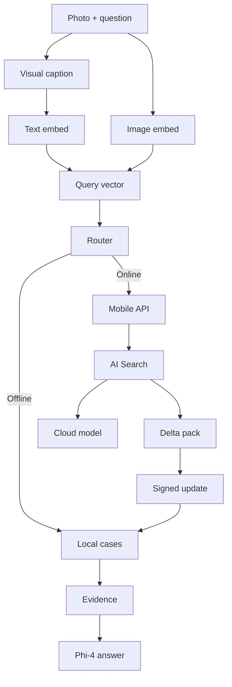

# Hybrid RAG with SLM Starter Kit

This starter kit demonstrates a hybrid computer-vision RAG pattern for construction field operations where network connectivity may be intermittent or unavailable. It combines:

- **Offline-first mobile edge**: photo query, local visual caption, local vector search, and Phi-4-mini grounded answer drafting.
- **Hybrid online path**: Azure AI Search plus Foundry / Azure OpenAI when connectivity is available.
- **Pack update path**: cloud ingestion builds signed delta packs that the device can cache for disconnected use.

The code is intentionally split into an **edge runtime prototype**, **local inference scripts**, and a **cloud API skeleton** so the same interfaces can be validated on a workstation or VM and later ported to iOS/Swift.

## Recommended implementation stack

| Layer | Current recommendation | Production notes |
| --- | --- | --- |
| Local visual caption / VQA | Moondream2 for the target iOS architecture, assuming an optimized Core ML / MLX package | Use BLIP or another small captioner as a fast fallback when Moondream is not practical on the available device. Benchmark the target iPhone runtime before production rollout. |
| Local image/text embedding | `openai/clip-vit-base-patch32` in the POC; evaluate MobileCLIP or a Core ML / ONNX CLIP variant for iOS | CLIP/MobileCLIP performs retrieval vectorization. Moondream improves query understanding but does not replace vector search. |
| On-device SLM | `microsoft/Phi-4-mini-instruct-onnx` CPU/mobile int4 with ONNX Runtime GenAI | Phi-4-mini is text-only. It receives retrieved evidence plus the local image caption as text and drafts cited guidance. |
| Local vector store | SQLite case pack; production can use `sqlite-vec` or USearch | `sqlite-vec` is pure C and runs anywhere SQLite runs. USearch has Swift/iOS bindings and HNSW ANN for larger packs. |
| Encrypted storage | SQLCipher + GRDB.swift / SQLite.swift on iOS | Python prototype uses normal SQLite; iOS app should use SQLCipher. |
| Cloud retrieval | Azure AI Search vector/hybrid search | Use classic RAG GA path first; pilot agentic retrieval when latency/preview status is acceptable. |
| Cloud reasoning | Azure AI Foundry Models / Azure OpenAI chat completions | Use GPT/VLM for online high-accuracy mode and image understanding. |
| Pack signing | TUF-style signed manifest and delta packs | Prototype has manifest fields; signing workflow should use Key Vault-backed keys. |

## Information flow



## Quick start: offline prototype

From this folder:

```powershell
python -m venv .venv
.\.venv\Scripts\Activate.ps1
pip install -r requirements.txt

python scripts\build_pack.py --input sample_cases.jsonl --db data\site-pack.sqlite
python scripts\query_offline.py --db data\site-pack.sqlite --query "Water is leaking through the basement retaining wall after heavy rain. What previous cases are similar and what should we do?"
```

By default the query uses:

- `DevelopmentHashingEmbedder`: deterministic local vectors for development.
- `ExtractiveFallbackGenerator`: generates a grounded answer without downloading Phi-4.

To enable Phi-4-mini ONNX locally, download the official ONNX int4 artifact and set `PHI4_ONNX_MODEL_DIR`:

```powershell
huggingface-cli download microsoft/Phi-4-mini-instruct-onnx --include cpu_and_mobile/cpu-int4-rtn-block-32-acc-level-4/* --local-dir models\phi4-mini-onnx
pip install --pre onnxruntime-genai
$env:PHI4_ONNX_MODEL_DIR = "models\phi4-mini-onnx\cpu_and_mobile\cpu-int4-rtn-block-32-acc-level-4"
python scripts\query_offline.py --db data\site-pack.sqlite --query "How do we handle honeycombing found after formwork removal?"
```

## Quick start: hybrid cloud API skeleton

```powershell
copy .env.example .env
uvicorn cloud_api.main:app --reload --port 8080
```

Example:

```powershell
curl -Method POST http://localhost:8080/query -ContentType "application/json" -Body '{"site_id":"demo-site","query":"crack near lift core after concrete pour","online":true}'
```

The cloud API intentionally returns a clear error until Azure settings are provided. Wire these environment variables:

- `AZURE_SEARCH_ENDPOINT`
- `AZURE_SEARCH_INDEX`
- `AZURE_SEARCH_API_KEY`
- `AZURE_OPENAI_ENDPOINT`
- `AZURE_OPENAI_API_KEY`
- `AZURE_OPENAI_DEPLOYMENT`

## Offline CV-RAG POC

This path avoids Azure AI Search and cloud inference at query time. The final offline notebook uses held-out query photos that are not indexed, local image captioning, local CLIP image/text/caption embeddings, SQLite vector search, and Phi-4-mini ONNX CPU/mobile answer drafting from retrieved evidence.

```powershell
pip install -r requirements.txt
python scripts\run_cv_rag_poc.py --workspace data\cv-rag --device cpu --generator template
```

On a GPU VM:

```bash
python scripts/run_cv_rag_poc.py \
  --workspace data/cv-rag \
  --device cuda \
  --generator template \
  --query "A site photo shows missing edge protection beside scaffold access. What incident response is needed?"
```

To test a fully offline run after model files are cached:

```bash
TRANSFORMERS_OFFLINE=1 HF_HUB_OFFLINE=1 \
python scripts/run_cv_rag_poc.py \
  --workspace data/cv-rag \
  --device cuda \
  --generator template \
  --offline \
  --skip-build \
  --query "A site photo shows concrete honeycombing after formwork removal. What should be done?"
```

For local SLM answer drafting, use Phi-4-mini after the model is cached on the VM:

```bash
python scripts/run_cv_rag_poc.py --workspace data/cv-rag --device cuda --generator phi4
```

The offline CV-RAG path uses:

- `openai/clip-vit-base-patch32` for local image/text embeddings.
- BLIP or Moondream2 for local visual captions. BLIP is the fast baseline; Moondream2 is the target iOS visual-understanding option when an optimized runtime is available.
- SQLite as the local vector store prototype.
- `microsoft/Phi-4-mini-instruct-onnx` CPU/mobile int4 as the local text answer generator in the real local report.
- A template generator as a deterministic fallback for resource-constrained validation runs.

The local image path is handled before Phi-4-mini-instruct:

1. The query photo is captioned locally by BLIP or Moondream2.
2. CLIP embeds the worker text, local image caption, and query image.
3. SQLite returns the closest cached incident evidence from the local case pack.
4. Phi-4-mini-instruct receives the retrieved evidence plus caption as text and drafts the response.

Phi-4-mini-instruct is not a vision model. If the SLM itself must directly inspect image + text input, use a vision-capable Phi model such as `microsoft/Phi-4-multimodal-instruct`; Microsoft describes it as processing text, image, and audio inputs and generating text outputs. See the official model cards for [`Phi-4-mini-instruct`](https://huggingface.co/microsoft/Phi-4-mini-instruct) and [`Phi-4-multimodal-instruct`](https://huggingface.co/microsoft/Phi-4-multimodal-instruct).

`Local-Offline-RAG.ipynb` records the real local Phi-4-mini ONNX CPU/mobile answer path. `Local-Offline-RAG-tc.ipynb` adds a Traditional Chinese offline-language validation for the same pattern. `Safety-Warning-RAG.ipynb` extends the same offline stack to safety-warning advisory. `Hybrid-RAG.ipynb` uses deterministic answer generation for the lifecycle comparison so the notebook focuses on offline context, online sync, and later offline enrichment.

### Canonical final demo notebooks

| Notebook | Purpose | Clean report folder |
| --- | --- | --- |
| `notebooks/Local-Offline-RAG.ipynb` | Offline-only held-out image queries, BLIP vs Moondream semantic comparison, and Phi-4-mini grounded local answers. | `notebooks/reports/local_offline_rag/` |
| `notebooks/Local-Offline-RAG-tc.ipynb` | Traditional Chinese full-offline validation: Phi-4-mini normalizes a Traditional Chinese field question plus local image body into an English retrieval query and returns the grounded answer in Traditional Chinese. | `notebooks/reports/local_offline_rag/` |
| `notebooks/Safety-Warning-RAG.ipynb` | Offline safety-warning advisory: one open-edge/scaffold-access image triggers a policy-gated warning, while one MEP coordination image remains a non-immediate safety follow-up. | `notebooks/reports/safety_warning_rag/` |
| `notebooks/Hybrid-RAG.ipynb` | Initial offline search, search-history-driven AI Search sync, later enriched offline search, and full online comparison. Selects Moondream for the target iOS architecture under a clear Core ML / MLX optimization assumption. | `notebooks/reports/hybrid_rag/` |

The hybrid report folder also includes `moondream_hybrid_validation_report.json`, a two-scenario validation run that uses Moondream captions for query images before online sync and later offline reuse.
The local offline report folder also includes `traditional_chinese_offline_report.json`, which records the TC query, Phi-4-mini normalized retrieval query, local top hit, Traditional Chinese answer, and timings. The TC runner injects construction terminology through a structured glossary prompt, and can load a project-specific glossary at runtime with `--glossary`.
The safety-warning report folder records the two-image advisory test, deterministic policy gate result, Phi-4-mini response, and the A10/edge-style batch-photo simulation boundary. It is not a real-time video monitoring or autonomous stop-work system.

Rebuild the canonical notebooks and normalized report folders:

```bash
python scripts/build_final_demo_notebooks.py
```

For a real local inference run, use:

- BLIP (`Salesforce/blip-image-captioning-base`) to produce a short local caption from the query photo.
- CLIP (`openai/clip-vit-base-patch32`) to embed query text + query image + caption for vector search.
- Phi-4-mini ONNX int4 (`microsoft/Phi-4-mini-instruct-onnx`) through ONNX Runtime GenAI for local text answer drafting.

In the recorded test environment, the local BLIP and CLIP stages ran on GPU. Phi-4-mini answer drafting used the official CPU/mobile int4 ONNX package because the GPU ONNX package required more VRAM than the test profile provided.

Model setup on the VM:

```bash
python3 -m pip install --pre onnxruntime-genai-cuda
python3 -m pip install 'huggingface_hub[hf_xet]>=0.34,<1.0'
hf download microsoft/Phi-4-mini-instruct-onnx \
  --include 'cpu_and_mobile/cpu-int4-rtn-block-32-acc-level-4/*' \
  --local-dir /opt/models/Phi-4-mini-instruct-onnx
```

Run the real local demo:

```bash
python3 scripts/run_real_local_inference_demo.py \
  --workspace notebooks/assets/cv_rag_enriched \
  --device cuda \
  --query-set notebooks/assets/real_local_inference/heldout_query_images.json \
  --phi4-onnx-model-dir /opt/models/Phi-4-mini-instruct-onnx/cpu_and_mobile/cpu-int4-rtn-block-32-acc-level-4 \
  --phi4-execution-provider follow_config
```

The recorded VM results are normalized into `notebooks/reports/local_offline_rag/` and rendered by `notebooks/Local-Offline-RAG.ipynb`. The successful run indexed six local enriched incidents and used four separate held-out query photos that were not indexed. Each held-out photo retrieved the expected historical case as the top-1 match:

| Held-out query | Expected case | Top retrieved case | Score |
| --- | --- | --- | --- |
| Basement water ingress | `INC-001` | `INC-001` | `0.8561` |
| Column honeycombing | `INC-002` | `INC-002` | `0.8443` |
| Scaffold edge protection | `INC-005` | `INC-005` | `0.8299` |
| Rebar congestion | `INC-003` | `INC-003` | `0.8260` |

Moondream2 was also tested as a richer image caption/VQA layer using the official `vikhyatk/moondream2` model at revision `2025-06-21`. In the recorded VM profile, Moondream2 fell back to CPU captioning. It still produced richer construction-site descriptions and kept top-1 retrieval correct for all four held-out queries, but CPU caption latency was not representative of an optimized iPhone deployment.

| Held-out query | BLIP top score | Moondream top score | Moondream caption device |
| --- | --- | --- | --- |
| Basement water ingress | `0.8561` | `0.8604` | CPU |
| Column honeycombing | `0.8443` | `0.8531` | CPU |
| Scaffold edge protection | `0.8299` | `0.8029` | CPU |
| Rebar congestion | `0.8260` | `0.8531` | CPU |

Interpretation: Moondream is the recommended visual-understanding layer for the target iOS architecture, assuming an optimized Core ML / MLX package. BLIP remains a fast caption baseline, while Moondream is the quality-oriented semantic option to validate on the target device.

To regenerate the held-out query-only image pack:

```bash
python scripts/generate_heldout_query_images.py \
  --endpoint "$AZURE_IMAGE_ENDPOINT" \
  --deployment "$AZURE_IMAGE_DEPLOYMENT" \
  --bearer-token "$AZURE_IMAGE_BEARER_TOKEN"
```

To rerun the Moondream comparison:

```bash
python3 scripts/run_real_local_inference_demo.py \
  --workspace notebooks/assets/cv_rag_enriched \
  --device cuda \
  --captioner moondream \
  --caption-device cpu \
  --query-set notebooks/assets/real_local_inference/heldout_query_images.json \
  --phi4-onnx-model-dir /opt/models/Phi-4-mini-instruct-onnx/cpu_and_mobile/cpu-int4-rtn-block-32-acc-level-4 \
  --phi4-execution-provider follow_config \
  --output notebooks/assets/real_local_inference/moondream_real_local_inference_report.json
```

Example image + text retrieval query:

```bash
python scripts/run_cv_rag_poc.py \
  --workspace data/cv-rag \
  --device cuda \
  --query "A column face has honeycombing and exposed aggregate after formwork removal. What should we do?" \
  --query-image data/cv-rag/images/inc_002_honeycombing.png
```

See `notebooks/Local-Offline-RAG.ipynb` for the documented offline-only run, held-out image query comparison, BLIP vs Moondream captions, local vector-store contents, retrieval results, and clean grounded answer examples.

## Hybrid online/offline comparison POC

The online comparison adds Azure AI Search and an optional Foundry / Azure OpenAI data-enrichment step while keeping the edge runtime offline-first.

POC components:

| Component | POC configuration |
| --- | --- |
| Azure AI Search | Online vector/hybrid index for enriched construction incident documents |
| Foundry / Azure OpenAI | Text model used to generate richer synthetic incident records and resolutions |
| Image generation | Azure OpenAI image generation used to create photorealistic construction-site incident images; deterministic diagrams remain available as a fallback |

Generate or refresh the enriched incident corpus and image assets:

```powershell
$env:AZURE_OPENAI_ENDPOINT = "https://<your-ai-services-resource>.cognitiveservices.azure.com/"
$env:AZURE_OPENAI_DEPLOYMENT = "<your-text-deployment>"
python scripts\generate_enriched_incidents_with_foundry.py `
  --output notebooks\assets\online_comparison\gpt54mini_enriched_incidents.json

$env:AZURE_IMAGE_ENDPOINT = "https://<your-image-resource>.cognitiveservices.azure.com/"
$env:AZURE_IMAGE_DEPLOYMENT = "<your-image-deployment>"
$env:AZURE_IMAGE_BEARER_TOKEN = az account get-access-token `
  --resource https://cognitiveservices.azure.com/ `
  --query accessToken `
  -o tsv

python scripts\generate_enriched_images.py `
  --mode azure-openai `
  --incidents-json notebooks\assets\online_comparison\gpt54mini_enriched_incidents.json `
  --output-dir notebooks\assets\cv_rag_enriched
```

If image endpoint variables are not supplied, `scripts\generate_enriched_images.py --mode diagram` writes deterministic fallback diagrams instead. The canonical notebooks should be rebuilt after retrieval reports are refreshed:

```powershell
python scripts\run_enriched_offline_eval.py `
  --workspace notebooks\assets\cv_rag_enriched `
  --device cuda `
  --generator template `
  --query-mode image-text `
  --preserve-images

python scripts\build_final_demo_notebooks.py
```

Build the Azure AI Search index and run the comparison:

```powershell
python scripts\build_online_index.py `
  --endpoint $env:SEARCH_ENDPOINT `
  --key $env:SEARCH_KEY `
  --index construction-incidents-online `
  --device cuda `
  --incidents-json notebooks\assets\online_comparison\gpt54mini_enriched_incidents.json

python scripts\run_offline_online_comparison.py `
  --endpoint $env:SEARCH_ENDPOINT `
  --key $env:SEARCH_KEY `
  --index construction-incidents-online `
  --workspace data\hybrid-comparison `
  --device cuda `
  --incidents-json notebooks\assets\online_comparison\gpt54mini_enriched_incidents.json
```

Run the context-lifecycle hybrid flow with Moondream visual captions. The two-scenario validation run demonstrates the full offline-to-online-to-enriched-offline cycle without running every scenario:

```powershell
python scripts\run_context_lifecycle_demo.py `
  --endpoint $env:SEARCH_ENDPOINT `
  --key $env:SEARCH_KEY `
  --index construction-incidents-online `
  --device cuda `
  --generator template `
  --captioner moondream `
  --caption-device cpu `
  --scenario-ids water-ingress-electrical temporary-works-prop `
  --output notebooks\assets\context_lifecycle\context_lifecycle_moondream_validation_report.json `
  --summary-output notebooks\assets\context_lifecycle\context_lifecycle_moondream_validation_summary.json
```

The verified VM run showed:

- Full offline enriched pack: 6 cases, 6 example queries, 100% top-1 retrieval on the synthetic pack.
- Context-lifecycle simulation starts from a cleaned local store with only `INC-001`, `INC-002`, and `INC-005`.
- When connectivity resumes, Azure AI Search retrieves and syncs `ONL-007`, `ONL-010`, and `ONL-011`.
- A later offline search retrieves those synced online-only cases from the local SQLite delta context.
- Full online search was run across 8 queries covering water/electrical risk, falling objects, spalling, temporary works, confined space, crane/overhead service, MEP clash, and lift-core crack.
- The Moondream two-scenario validation run uses local image captions before online sync and stages `ONL-007` and `ONL-010`.

See `notebooks/Hybrid-RAG.ipynb` for the context-lifecycle run and `notebooks/reports/hybrid_rag/` for normalized machine-readable result summaries, including `moondream_hybrid_validation_report.json`.

## Directory layout

```text
edge_runtime/
  config.py          Runtime settings.
  embeddings.py      Development embedder plus extension seam for ONNX embedding models.
  phi4_client.py     Phi-4 ONNX Runtime GenAI adapter with grounded fallback.
  vector_store.py    SQLite local vector store and cosine retrieval.
  packs.py           Case-pack build/load helpers.
  rag.py             Offline/hybrid RAG orchestration.
cloud_api/
  main.py            FastAPI mobile BFF skeleton.
  azure_search.py    Azure AI Search + chat completion integration seam.
scripts/
  build_pack.py      Converts JSONL cases into a local pack DB.
  query_offline.py   Runs offline RAG against the local pack.
  run_cv_rag_poc.py  Runs synthetic offline CV-RAG with image vectorization.
  run_real_local_inference_demo.py
                    Runs held-out query photos through BLIP or Moondream captions, CLIP retrieval, and Phi-4-mini ONNX.
  generate_enriched_incidents_with_foundry.py
                    Uses a Foundry / Azure OpenAI chat deployment to generate richer synthetic incident records.
  generate_enriched_images.py
                    Regenerates illustrative incident images from enriched captions and visual clues.
  generate_heldout_query_images.py
                    Generates query-only photorealistic field photos that are not indexed.
  run_enriched_offline_eval.py
                    Runs the full offline enriched CV-RAG evaluation.
  build_online_index.py
                    Builds the Azure AI Search online vector/hybrid index.
  run_offline_online_comparison.py
                    Compares offline seed retrieval, online enriched retrieval, and synced offline delta retrieval.
  run_context_lifecycle_demo.py
                    Demonstrates limited offline context, Moondream-caption validation runs, online resume, selective sync, and later offline search.
  run_safety_warning_demo.py
                    Demonstrates a two-image offline safety-warning advisory gate using the same local evidence and Phi-4-mini answer path.
  build_final_demo_notebooks.py
                    Builds the canonical notebooks and normalized report folders.
cv_rag/
  enriched_dataset.py
                    Converts enriched online incident records into local CV-RAG incident records and image names.
  synthetic_data.py  Generates synthetic construction incidents and images.
  models.py          CLIP embedder plus BLIP, Moondream, and Phi-4-mini generator adapters.
  store.py           SQLite image-vector store.
  pipeline.py        Index and query orchestration.
online_rag/
  enriched_data.py   Built-in enriched incident corpus plus generated JSON loader.
  azure_search.py    Azure AI Search vector index schema and query client.
  sync_store.py      SQLite delta store for online cases retained for later offline search.
notebooks/
  Local-Offline-RAG.ipynb
                    Offline-only held-out photo queries, BLIP vs Moondream comparison, and Phi-4-mini grounded answers.
  Local-Offline-RAG-tc.ipynb
                    Traditional Chinese full-offline query normalization and grounded answer validation.
  Safety-Warning-RAG.ipynb
                    Offline safety-warning advisory demo with one warning case and one non-immediate-safety control.
  Hybrid-RAG.ipynb
                    Hybrid lifecycle: initial offline, online sync, enriched offline, full online comparison, and Moondream validation run.
  reports/
                    Normalized report folders for the final notebooks.
sample_cases.jsonl   Small construction-case sample set.
```

## Porting notes for iPhone implementation

1. Keep the Python interfaces: `Captioner`, `Embedder`, `VectorStore`, `Generator`, `QueryRouter`.
2. Use Moondream as the target iOS visual-context layer if an optimized Core ML / MLX package meets latency and thermal targets; keep BLIP or a smaller captioner as fallback.
3. Replace the prototype SQLite store with SQLCipher plus `sqlite-vec` or USearch.
4. Replace the POC CLIP runtime with MobileCLIP, Core ML CLIP, or ONNX Runtime Mobile depending on measured iPhone performance.
5. Use ONNX Runtime GenAI for Phi-4-mini answer drafting; cap context and answer length because Phi-4-mini is text-only and should only receive retrieved evidence plus local captions.
6. Treat the device answer as **evidence-grounded guidance**, not autonomous approval. Escalate high-risk safety/compliance cases to cloud or human supervisor.

## Official references used

- Microsoft Phi-4-mini ONNX model card: `microsoft/Phi-4-mini-instruct-onnx`
- Microsoft Phi-4-mini model card: `microsoft/Phi-4-mini-instruct`
- OpenAI CLIP model card: `openai/clip-vit-base-patch32`
- Moondream2 model card: `vikhyatk/moondream2`
- BLIP image captioning model card: `Salesforce/blip-image-captioning-base`
- ONNX Runtime GenAI documentation: generate loop, tokenization, KV cache, structured output support.
- Azure AI Search RAG overview: classic hybrid search and agentic retrieval patterns.
- Azure AI Search vector search overview: vector, hybrid, multimodal, and multilingual search.
- sqlite-vec project: pure C SQLite vector extension.
- USearch project: compact HNSW vector search with Swift/iOS bindings.
- SQLCipher: encrypted SQLite for mobile and embedded apps.
