# Hybrid RAG with SLM Starter Kit

This starter kit shows how to realize a hybrid field-copilot stack with:

- **Offline-first mobile edge**: local case pack, local vector search, Phi-4-mini answer drafting.
- **Hybrid online path**: Azure AI Search + Foundry / Azure OpenAI when connectivity is available.
- **Pack update path**: cloud ingestion builds signed delta packs that the device can cache for disconnected use.

The code is intentionally split into an **edge runtime prototype** and a **cloud API skeleton** so the team can validate behavior on a laptop first, then port the same interfaces to iOS/Swift.

## Recommended implementation stack

| Layer | MVP recommendation | Production notes |
| --- | --- | --- |
| On-device SLM | `microsoft/Phi-4-mini-instruct-onnx` int4 CPU/mobile with ONNX Runtime GenAI | Use 2K-4K context on phone to control memory and thermals. Keep long-context or VLM reasoning in cloud. |
| Local text embedding | `intfloat/multilingual-e5-small` converted to ONNX | This prototype uses a deterministic hashing embedder so it runs without model downloads; replace with ONNX Runtime inference for real retrieval quality. |
| Local vector store | SQLite case pack; production can use `sqlite-vec` or USearch | `sqlite-vec` is pure C and runs anywhere SQLite runs. USearch has Swift/iOS bindings and HNSW ANN for larger packs. |
| Encrypted storage | SQLCipher + GRDB.swift / SQLite.swift on iOS | Python prototype uses normal SQLite; iOS app should use SQLCipher. |
| Cloud retrieval | Azure AI Search vector/hybrid search | Use classic RAG GA path first; pilot agentic retrieval when latency/preview status is acceptable. |
| Cloud reasoning | Azure AI Foundry Models / Azure OpenAI chat completions | Use GPT/VLM for online high-accuracy mode and image understanding. |
| Pack signing | TUF-style signed manifest and delta packs | Prototype has manifest fields; signing workflow should use Key Vault-backed keys. |

## Information flow

```mermaid
flowchart LR
  Worker[Field worker photo + text query] --> Router[Connectivity-aware query router]
  Router -->|offline| Embed[Local embedding model]
  Embed --> LocalIndex[Local vector store in encrypted case pack]
  LocalIndex --> Evidence[Evidence builder with citations + policy rules]
  Evidence --> Phi[Phi-4-mini ONNX int4 via ONNX Runtime GenAI]
  Phi --> Action[Action card: steps, caveats, escalation]

  Router -->|online if reachable| BFF[Azure API Management + Mobile BFF]
  BFF --> Search[Azure AI Search hybrid/vector retrieval]
  Search --> CloudLLM[Foundry / Azure OpenAI GPT or VLM]
  CloudLLM --> Evidence

  Action --> Outbox[Offline outbox: feedback/photos/case draft]
  Outbox -->|sync when online| Ingestion[Blob/Data Lake + Content Understanding + Vision embeddings]
  Ingestion --> PackBuilder[Pack builder]
  PackBuilder --> SignedPack[Signed delta pack manifest]
  SignedPack --> LocalIndex
```



## Quick start: offline prototype

From this folder:

```powershell
python -m venv .venv
.\.venv\Scripts\Activate.ps1
pip install -r requirements.txt

python scripts\build_pack.py --input sample_cases.jsonl --db data\site-pack.sqlite
python scripts\query_offline.py --db data\site-pack.sqlite --query "Water is leaking through the basement retaining wall after heavy rain. What previous cases are similar and what should we do?"
```

By default the query uses:

- `DevelopmentHashingEmbedder`: deterministic local vectors for development.
- `ExtractiveFallbackGenerator`: generates a grounded answer without downloading Phi-4.

To enable Phi-4-mini ONNX locally, download the official ONNX int4 artifact and set `PHI4_ONNX_MODEL_DIR`:

```powershell
huggingface-cli download microsoft/Phi-4-mini-instruct-onnx --include cpu_and_mobile/cpu-int4-rtn-block-32-acc-level-4/* --local-dir models\phi4-mini-onnx
pip install --pre onnxruntime-genai
$env:PHI4_ONNX_MODEL_DIR = "models\phi4-mini-onnx\cpu_and_mobile\cpu-int4-rtn-block-32-acc-level-4"
python scripts\query_offline.py --db data\site-pack.sqlite --query "How do we handle honeycombing found after formwork removal?"
```

## Quick start: hybrid cloud API skeleton

```powershell
copy .env.example .env
uvicorn cloud_api.main:app --reload --port 8080
```

Example:

```powershell
curl -Method POST http://localhost:8080/query -ContentType "application/json" -Body '{"site_id":"demo-site","query":"crack near lift core after concrete pour","online":true}'
```

The cloud API intentionally returns a clear error until Azure settings are provided. Wire these environment variables:

- `AZURE_SEARCH_ENDPOINT`
- `AZURE_SEARCH_INDEX`
- `AZURE_SEARCH_API_KEY`
- `AZURE_OPENAI_ENDPOINT`
- `AZURE_OPENAI_API_KEY`
- `AZURE_OPENAI_DEPLOYMENT`

## Offline CV-RAG POC

This POC avoids Azure AI Search and cloud inference. It generates synthetic construction incident records and images, embeds the images with local CLIP, stores vectors in SQLite, retrieves visually similar incidents from a text query, and drafts an incident response from local evidence.

```powershell
pip install -r requirements.txt
python scripts\run_cv_rag_poc.py --workspace data\cv-rag --device cpu --generator template
```

On a GPU VM:

```bash
python scripts/run_cv_rag_poc.py \
  --workspace data/cv-rag \
  --device cuda \
  --generator template \
  --query "A site photo shows missing edge protection beside scaffold access. What incident response is needed?"
```

To test a fully offline run after model files are cached:

```bash
TRANSFORMERS_OFFLINE=1 HF_HUB_OFFLINE=1 \
python scripts/run_cv_rag_poc.py \
  --workspace data/cv-rag \
  --device cuda \
  --generator template \
  --offline \
  --skip-build \
  --query "A site photo shows concrete honeycombing after formwork removal. What should be done?"
```

For local SLM answer drafting, use Phi-4-mini after the model is cached on the VM:

```bash
python scripts/run_cv_rag_poc.py --workspace data/cv-rag --device cuda --generator phi4
```

The CV-RAG POC uses:

- `openai/clip-vit-base-patch32` for local image/text embeddings.
- SQLite as the local vector store prototype.
- `microsoft/Phi-4-mini-instruct` as the optional local answer generator.
- A template generator as a deterministic fallback for resource-constrained/offline smoke tests.

See `notebooks/offline_cv_rag_results.ipynb` for a documented six-scenario run, retrieval scores, top-1 accuracy, and a representative grounded answer.

## Directory layout

```text
edge_runtime/
  config.py          Runtime settings.
  embeddings.py      Development embedder plus extension seam for ONNX embedding models.
  phi4_client.py     Phi-4 ONNX Runtime GenAI adapter with grounded fallback.
  vector_store.py    SQLite local vector store and cosine retrieval.
  packs.py           Case-pack build/load helpers.
  rag.py             Offline/hybrid RAG orchestration.
cloud_api/
  main.py            FastAPI mobile BFF skeleton.
  azure_search.py    Azure AI Search + chat completion integration seam.
scripts/
  build_pack.py      Converts JSONL cases into a local pack DB.
  query_offline.py   Runs offline RAG against the local pack.
  run_cv_rag_poc.py  Runs synthetic offline CV-RAG with image vectorization.
cv_rag/
  synthetic_data.py  Generates synthetic construction incidents and images.
  models.py          CLIP embedder plus optional Phi-4-mini generator.
  store.py           SQLite image-vector store.
  pipeline.py        Index and query orchestration.
notebooks/
  offline_cv_rag_results.ipynb  Documented offline CV-RAG evaluation run.
sample_cases.jsonl   Small construction-case sample set.
```

## Porting notes for iPhone implementation

1. Keep the Python interfaces: `Embedder`, `VectorStore`, `Generator`, `QueryRouter`.
2. Replace `SQLiteVectorStore` with SQLCipher + `sqlite-vec` or USearch.
3. Replace `DevelopmentHashingEmbedder` with ONNX Runtime Mobile running `multilingual-e5-small`, or precompute vectors in cloud packs if MVP scope is tight.
4. Use ONNX Runtime GenAI for Phi-4-mini answer drafting; cap context and answer length.
5. Treat the device answer as **evidence-grounded guidance**, not autonomous approval. Escalate high-risk safety/compliance cases to cloud or human supervisor.

## Official references used

- Microsoft Phi-4-mini ONNX model card: `microsoft/Phi-4-mini-instruct-onnx`
- Microsoft Phi-4-mini model card: `microsoft/Phi-4-mini-instruct`
- OpenAI CLIP model card: `openai/clip-vit-base-patch32`
- ONNX Runtime GenAI documentation: generate loop, tokenization, KV cache, structured output support.
- Azure AI Search RAG overview: classic hybrid search and agentic retrieval patterns.
- Azure AI Search vector search overview: vector, hybrid, multimodal, and multilingual search.
- sqlite-vec project: pure C SQLite vector extension.
- USearch project: compact HNSW vector search with Swift/iOS bindings.
- SQLCipher: encrypted SQLite for mobile and embedded apps.
