# Hybrid RAG with SLM Starter Kit

This starter kit shows how to realize a hybrid field-copilot stack with:

- **Offline-first mobile edge**: local case pack, local vector search, Phi-4-mini answer drafting.
- **Hybrid online path**: Azure AI Search + Foundry / Azure OpenAI when connectivity is available.
- **Pack update path**: cloud ingestion builds signed delta packs that the device can cache for disconnected use.

The code is intentionally split into an **edge runtime prototype** and a **cloud API skeleton** so the team can validate behavior on a laptop first, then port the same interfaces to iOS/Swift.

## Recommended implementation stack

| Layer | MVP recommendation | Production notes |
| --- | --- | --- |
| On-device SLM | `microsoft/Phi-4-mini-instruct-onnx` int4 CPU/mobile with ONNX Runtime GenAI | Use 2K-4K context on phone to control memory and thermals. Keep long-context or VLM reasoning in cloud. |
| Local text embedding | `intfloat/multilingual-e5-small` converted to ONNX | This prototype uses a deterministic hashing embedder so it runs without model downloads; replace with ONNX Runtime inference for real retrieval quality. |
| Local vector store | SQLite case pack; production can use `sqlite-vec` or USearch | `sqlite-vec` is pure C and runs anywhere SQLite runs. USearch has Swift/iOS bindings and HNSW ANN for larger packs. |
| Encrypted storage | SQLCipher + GRDB.swift / SQLite.swift on iOS | Python prototype uses normal SQLite; iOS app should use SQLCipher. |
| Cloud retrieval | Azure AI Search vector/hybrid search | Use classic RAG GA path first; pilot agentic retrieval when latency/preview status is acceptable. |
| Cloud reasoning | Azure AI Foundry Models / Azure OpenAI chat completions | Use GPT/VLM for online high-accuracy mode and image understanding. |
| Pack signing | TUF-style signed manifest and delta packs | Prototype has manifest fields; signing workflow should use Key Vault-backed keys. |

## Information flow

```mermaid
flowchart LR
  Worker[Field worker photo + text query] --> Router[Connectivity-aware query router]
  Router -->|offline| Embed[Local embedding model]
  Embed --> LocalIndex[Local vector store in encrypted case pack]
  LocalIndex --> Evidence[Evidence builder with citations + policy rules]
  Evidence --> Phi[Phi-4-mini ONNX int4 via ONNX Runtime GenAI]
  Phi --> Action[Action card: steps, caveats, escalation]

  Router -->|online if reachable| BFF[Azure API Management + Mobile BFF]
  BFF --> Search[Azure AI Search hybrid/vector retrieval]
  Search --> CloudLLM[Foundry / Azure OpenAI GPT or VLM]
  CloudLLM --> Evidence

  Action --> Outbox[Offline outbox: feedback/photos/case draft]
  Outbox -->|sync when online| Ingestion[Blob/Data Lake + Content Understanding + Vision embeddings]
  Ingestion --> PackBuilder[Pack builder]
  PackBuilder --> SignedPack[Signed delta pack manifest]
  SignedPack --> LocalIndex
```



## Quick start: offline prototype

From this folder:

```powershell
python -m venv .venv
.\.venv\Scripts\Activate.ps1
pip install -r requirements.txt

python scripts\build_pack.py --input sample_cases.jsonl --db data\site-pack.sqlite
python scripts\query_offline.py --db data\site-pack.sqlite --query "Water is leaking through the basement retaining wall after heavy rain. What previous cases are similar and what should we do?"
```

By default the query uses:

- `DevelopmentHashingEmbedder`: deterministic local vectors for development.
- `ExtractiveFallbackGenerator`: generates a grounded answer without downloading Phi-4.

To enable Phi-4-mini ONNX locally, download the official ONNX int4 artifact and set `PHI4_ONNX_MODEL_DIR`:

```powershell
huggingface-cli download microsoft/Phi-4-mini-instruct-onnx --include cpu_and_mobile/cpu-int4-rtn-block-32-acc-level-4/* --local-dir models\phi4-mini-onnx
pip install --pre onnxruntime-genai
$env:PHI4_ONNX_MODEL_DIR = "models\phi4-mini-onnx\cpu_and_mobile\cpu-int4-rtn-block-32-acc-level-4"
python scripts\query_offline.py --db data\site-pack.sqlite --query "How do we handle honeycombing found after formwork removal?"
```

## Quick start: hybrid cloud API skeleton

```powershell
copy .env.example .env
uvicorn cloud_api.main:app --reload --port 8080
```

Example:

```powershell
curl -Method POST http://localhost:8080/query -ContentType "application/json" -Body '{"site_id":"demo-site","query":"crack near lift core after concrete pour","online":true}'
```

The cloud API intentionally returns a clear error until Azure settings are provided. Wire these environment variables:

- `AZURE_SEARCH_ENDPOINT`
- `AZURE_SEARCH_INDEX`
- `AZURE_SEARCH_API_KEY`
- `AZURE_OPENAI_ENDPOINT`
- `AZURE_OPENAI_API_KEY`
- `AZURE_OPENAI_DEPLOYMENT`

## Offline CV-RAG POC

This POC avoids Azure AI Search and cloud inference. It generates synthetic construction incident records and images, embeds the images with local CLIP, stores vectors in SQLite, retrieves visually similar incidents from a text query, and drafts an incident response from local evidence.

```powershell
pip install -r requirements.txt
python scripts\run_cv_rag_poc.py --workspace data\cv-rag --device cpu --generator template
```

On a GPU VM:

```bash
python scripts/run_cv_rag_poc.py \
  --workspace data/cv-rag \
  --device cuda \
  --generator template \
  --query "A site photo shows missing edge protection beside scaffold access. What incident response is needed?"
```

To test a fully offline run after model files are cached:

```bash
TRANSFORMERS_OFFLINE=1 HF_HUB_OFFLINE=1 \
python scripts/run_cv_rag_poc.py \
  --workspace data/cv-rag \
  --device cuda \
  --generator template \
  --offline \
  --skip-build \
  --query "A site photo shows concrete honeycombing after formwork removal. What should be done?"
```

For local SLM answer drafting, use Phi-4-mini after the model is cached on the VM:

```bash
python scripts/run_cv_rag_poc.py --workspace data/cv-rag --device cuda --generator phi4
```

The CV-RAG POC uses:

- `openai/clip-vit-base-patch32` for local image/text embeddings.
- SQLite as the local vector store prototype.
- `microsoft/Phi-4-mini-instruct` as the optional local text answer generator.
- A template generator as a deterministic fallback for resource-constrained/offline smoke tests.

The local image path is handled by CLIP, not by Phi-4-mini-instruct:

1. A worker text query is embedded locally with CLIP.
2. If `--query-image` is provided, the query photo is also embedded locally with CLIP and fused with the text vector.
3. SQLite returns the closest cached incident evidence.
4. Phi-4-mini-instruct receives the retrieved evidence as text and drafts the response.

Phi-4-mini-instruct is not a vision model. If the SLM itself must directly inspect image + text input, use a vision-capable Phi model such as `microsoft/Phi-4-multimodal-instruct`; Microsoft describes it as processing text, image, and audio inputs and generating text outputs. See the official model cards for [`Phi-4-mini-instruct`](https://huggingface.co/microsoft/Phi-4-mini-instruct) and [`Phi-4-multimodal-instruct`](https://huggingface.co/microsoft/Phi-4-multimodal-instruct).

The offline and hybrid comparison notebooks use `--generator template` for deterministic, resource-safe validation on the 4 GB A10 vGPU VM. The real local inference notebook below records an actual Phi-4-mini ONNX run.

### Real local inference experiment

For a non-deterministic local run on the A10 VM, use:

- BLIP (`Salesforce/blip-image-captioning-base`) to produce a short local caption from the query photo.
- CLIP (`openai/clip-vit-base-patch32`) to embed query text + query image + caption for vector search.
- Phi-4-mini ONNX int4 (`microsoft/Phi-4-mini-instruct-onnx`) through ONNX Runtime GenAI for local text answer drafting.

The 4 GB `NVIDIA A10-4Q` vGPU successfully runs the local BLIP/CLIP stages, but the official Phi-4-mini ONNX GPU int4 package did not fit in that framebuffer. The successful VM run therefore used the official CPU/mobile int4 Phi-4-mini ONNX package for answer drafting while keeping retrieval fully local.

Model setup on the VM:

```bash
python3 -m pip install --pre onnxruntime-genai-cuda
python3 -m pip install 'huggingface_hub[hf_xet]>=0.34,<1.0'
hf download microsoft/Phi-4-mini-instruct-onnx \
  --include 'cpu_and_mobile/cpu-int4-rtn-block-32-acc-level-4/*' \
  --local-dir /opt/models/Phi-4-mini-instruct-onnx
```

Run the real local demo:

```bash
python3 scripts/run_real_local_inference_demo.py \
  --workspace notebooks/assets/cv_rag_enriched \
  --device cuda \
  --query-set notebooks/assets/real_local_inference/heldout_query_images.json \
  --phi4-onnx-model-dir /opt/models/Phi-4-mini-instruct-onnx/cpu_and_mobile/cpu-int4-rtn-block-32-acc-level-4 \
  --phi4-execution-provider follow_config
```

The recorded VM result is in `notebooks/real_local_inference_cv_rag.ipynb` and `notebooks/assets/real_local_inference/real_local_inference_report.json`. The successful run indexed six local enriched incidents and used four separate held-out query photos that were not indexed. Each held-out photo retrieved the expected historical case as the top-1 match:

| Held-out query | Expected case | Top retrieved case | Score |
| --- | --- | --- | --- |
| Basement water ingress | `INC-001` | `INC-001` | `0.8561` |
| Column honeycombing | `INC-002` | `INC-002` | `0.8443` |
| Scaffold edge protection | `INC-005` | `INC-005` | `0.8299` |
| Rebar congestion | `INC-003` | `INC-003` | `0.8260` |

Moondream2 was also tested as a richer image caption/VQA layer using the official `vikhyatk/moondream2` model at revision `2025-06-21`. On the 4 GB `NVIDIA A10-4Q` profile, Moondream2 did not fit on CUDA and fell back to CPU captioning. It still produced richer construction-site descriptions and kept top-1 retrieval correct for all four held-out queries, but CPU caption latency was about 220 seconds per image in this VM profile.

| Held-out query | BLIP top score | Moondream top score | Moondream caption device |
| --- | --- | --- | --- |
| Basement water ingress | `0.8561` | `0.8604` | CPU |
| Column honeycombing | `0.8443` | `0.8531` | CPU |
| Scaffold edge protection | `0.8299` | `0.8029` | CPU |
| Rebar congestion | `0.8260` | `0.8531` | CPU |

Interpretation: Moondream is a better semantic image-understanding candidate than BLIP, but this VM is too memory-limited for a practical CUDA Moondream2 run. For mobile production, evaluate an Apple-optimized Core ML / MLX Moondream package or a smaller official Moondream release if available; for this A10 POC, BLIP remains the fast caption baseline and Moondream is documented as a quality-oriented CPU comparison.

To regenerate the held-out query-only image pack:

```bash
python scripts/generate_heldout_query_images.py \
  --endpoint "$AZURE_IMAGE_ENDPOINT" \
  --deployment "$AZURE_IMAGE_DEPLOYMENT" \
  --bearer-token "$AZURE_IMAGE_BEARER_TOKEN"
```

To rerun the Moondream comparison:

```bash
python3 scripts/run_real_local_inference_demo.py \
  --workspace notebooks/assets/cv_rag_enriched \
  --device cuda \
  --captioner moondream \
  --caption-device cpu \
  --query-set notebooks/assets/real_local_inference/heldout_query_images.json \
  --phi4-onnx-model-dir /opt/models/Phi-4-mini-instruct-onnx/cpu_and_mobile/cpu-int4-rtn-block-32-acc-level-4 \
  --phi4-execution-provider follow_config \
  --output notebooks/assets/real_local_inference/moondream_real_local_inference_report.json
```

Example image + text retrieval query:

```bash
python scripts/run_cv_rag_poc.py \
  --workspace data/cv-rag \
  --device cuda \
  --query "A column face has honeycombing and exposed aggregate after formwork removal. What should we do?" \
  --query-image data/cv-rag/images/inc_002_honeycombing.png
```

See `notebooks/offline_cv_rag_results.ipynb` for a documented enriched six-scenario run, regenerated images, local vector-store contents, retrieval results, and clean grounded answer examples.

## Hybrid online/offline comparison POC

The online comparison adds Azure AI Search and an optional Foundry / Azure OpenAI data-enrichment step while keeping the edge runtime offline-first.

Provisioned POC components:

| Component | POC configuration |
| --- | --- |
| Azure AI Search | `srch-hybrid-rag-887070`, index `construction-incidents-online`, 12 enriched incident documents |
| Foundry / AI Services | `aif-hybrid-rag-338698` in `rg-hybrid-rag-slm-poc` |
| Text generation | `gpt-5.4-mini` deployment `gpt-5-4-mini-enrich`, used to generate richer synthetic incident cases and resolutions |
| Image generation | South Central US `MAI-Image-2.5-Flash` quota is fully used (`2 / 2`), so the notebook image pack uses an existing Azure OpenAI `gpt-image-1.5` deployment to create photorealistic construction-site incident images. The deterministic diagram generator remains available as a fallback. |

Generate or refresh the enriched incident corpus and image assets:

```powershell
$env:AZURE_OPENAI_ENDPOINT = "https://aif-hybrid-rag-338698.cognitiveservices.azure.com/"
$env:AZURE_OPENAI_DEPLOYMENT = "gpt-5-4-mini-enrich"
python scripts\generate_enriched_incidents_with_foundry.py `
  --output notebooks\assets\online_comparison\gpt54mini_enriched_incidents.json

$env:AZURE_IMAGE_ENDPOINT = "https://proj-samsonlee-swedence-resource.cognitiveservices.azure.com/"
$env:AZURE_IMAGE_DEPLOYMENT = "gpt-image-1.5"
$env:AZURE_IMAGE_BEARER_TOKEN = az account get-access-token `
  --resource https://cognitiveservices.azure.com/ `
  --query accessToken `
  -o tsv

python scripts\generate_enriched_images.py `
  --mode azure-openai `
  --incidents-json notebooks\assets\online_comparison\gpt54mini_enriched_incidents.json `
  --output-dir notebooks\assets\cv_rag_enriched
```

If image endpoint variables are not supplied, `scripts\generate_enriched_images.py --mode diagram` writes deterministic fallback diagrams instead. The offline and hybrid notebooks should be rebuilt after retrieval reports are refreshed:

```powershell
python scripts\run_enriched_offline_eval.py `
  --workspace notebooks\assets\cv_rag_enriched `
  --device cuda `
  --generator template `
  --query-mode image-text `
  --preserve-images

python scripts\build_notebooks.py
```

Build the Azure AI Search index and run the comparison:

```powershell
python scripts\build_online_index.py `
  --endpoint $env:SEARCH_ENDPOINT `
  --key $env:SEARCH_KEY `
  --index construction-incidents-online `
  --device cuda `
  --incidents-json notebooks\assets\online_comparison\gpt54mini_enriched_incidents.json

python scripts\run_offline_online_comparison.py `
  --endpoint $env:SEARCH_ENDPOINT `
  --key $env:SEARCH_KEY `
  --index construction-incidents-online `
  --workspace data\hybrid-comparison `
  --device cuda `
  --incidents-json notebooks\assets\online_comparison\gpt54mini_enriched_incidents.json
```

The verified VM run showed:

- Full offline enriched pack: 6 cases, 6 example queries, 100% top-1 retrieval on the synthetic pack.
- Context-lifecycle simulation starts from a cleaned local store with only `INC-001`, `INC-002`, and `INC-005`.
- When connectivity resumes, Azure AI Search retrieves and syncs `ONL-007`, `ONL-010`, and `ONL-011`.
- A later offline search retrieves those synced online-only cases from the local SQLite delta context.
- Full online search was run across 8 queries covering water/electrical risk, falling objects, spalling, temporary works, confined space, crane/overhead service, MEP clash, and lift-core crack.

See `notebooks/field_context_lifecycle_hybrid_rag.ipynb` for the context-lifecycle run and `notebooks/assets/context_lifecycle/context_lifecycle_summary.json` for the compact machine-readable result summary.

## Directory layout

```text
edge_runtime/
  config.py          Runtime settings.
  embeddings.py      Development embedder plus extension seam for ONNX embedding models.
  phi4_client.py     Phi-4 ONNX Runtime GenAI adapter with grounded fallback.
  vector_store.py    SQLite local vector store and cosine retrieval.
  packs.py           Case-pack build/load helpers.
  rag.py             Offline/hybrid RAG orchestration.
cloud_api/
  main.py            FastAPI mobile BFF skeleton.
  azure_search.py    Azure AI Search + chat completion integration seam.
scripts/
  build_pack.py      Converts JSONL cases into a local pack DB.
  query_offline.py   Runs offline RAG against the local pack.
  run_cv_rag_poc.py  Runs synthetic offline CV-RAG with image vectorization.
  generate_enriched_incidents_with_foundry.py
                    Uses a Foundry / Azure OpenAI chat deployment to generate richer synthetic incident records.
  generate_enriched_images.py
                    Regenerates illustrative incident images from enriched captions and visual clues.
  run_enriched_offline_eval.py
                    Runs the full offline enriched CV-RAG evaluation.
  build_online_index.py
                    Builds the Azure AI Search online vector/hybrid index.
  run_offline_online_comparison.py
                    Compares offline seed retrieval, online enriched retrieval, and synced offline delta retrieval.
  run_context_lifecycle_demo.py
                    Demonstrates limited offline context, online resume, selective sync, and later offline search.
cv_rag/
  enriched_dataset.py
                    Converts enriched online incident records into local CV-RAG incident records and image names.
  synthetic_data.py  Generates synthetic construction incidents and images.
  models.py          CLIP embedder plus optional Phi-4-mini generator.
  store.py           SQLite image-vector store.
  pipeline.py        Index and query orchestration.
online_rag/
  enriched_data.py   Built-in enriched incident corpus plus generated JSON loader.
  azure_search.py    Azure AI Search vector index schema and query client.
  sync_store.py      SQLite delta store for online cases retained for later offline search.
notebooks/
  offline_cv_rag_results.ipynb  Documented offline CV-RAG evaluation run.
  field_context_lifecycle_hybrid_rag.ipynb
                    Context-lifecycle hybrid run: limited local context, online resume, synced offline delta, and full online search.
sample_cases.jsonl   Small construction-case sample set.
```

## Porting notes for iPhone implementation

1. Keep the Python interfaces: `Embedder`, `VectorStore`, `Generator`, `QueryRouter`.
2. Replace `SQLiteVectorStore` with SQLCipher + `sqlite-vec` or USearch.
3. Replace `DevelopmentHashingEmbedder` with ONNX Runtime Mobile running `multilingual-e5-small`, or precompute vectors in cloud packs if MVP scope is tight.
4. Use ONNX Runtime GenAI for Phi-4-mini answer drafting; cap context and answer length.
5. Treat the device answer as **evidence-grounded guidance**, not autonomous approval. Escalate high-risk safety/compliance cases to cloud or human supervisor.

## Official references used

- Microsoft Phi-4-mini ONNX model card: `microsoft/Phi-4-mini-instruct-onnx`
- Microsoft Phi-4-mini model card: `microsoft/Phi-4-mini-instruct`
- OpenAI CLIP model card: `openai/clip-vit-base-patch32`
- ONNX Runtime GenAI documentation: generate loop, tokenization, KV cache, structured output support.
- Azure AI Search RAG overview: classic hybrid search and agentic retrieval patterns.
- Azure AI Search vector search overview: vector, hybrid, multimodal, and multilingual search.
- sqlite-vec project: pure C SQLite vector extension.
- USearch project: compact HNSW vector search with Swift/iOS bindings.
- SQLCipher: encrypted SQLite for mobile and embedded apps.
